

{{ site.time | date_to_rfc822 }}

  

# DRAFT NISTIR 8149

# Developing Trust Frameworks to Support Identity Federations

David Temoshok  
Christine Abruzzi  

# DRAFT NISTIR 8149

# Developing Trust Frameworks to Support Identity Federations

David Temoshok  
*Applied Cybersecurity Division  
Information Technology Laboratory*  

Christine Abruzzi  
*Deloitte & Touche LLP  
Rosslyn, VA*  

 
September 2016

U.S. Department of Commerce  
*Penny Pritzker, Secretary*

National Institute of Standards and Technology  
*Willie E. May, Under Secretary of Commerce for Standards and
Technology and Director*

   

National Institute of Standards and Technology Internal Report 8149  
33 pages (September 2016)

 

Certain commercial entities, equipment, or materials may be identified in this document in order to describe an experimental procedure or concept adequately. Such identification is not intended to imply recommendation or endorsement by NIST, nor is it intended to imply that the entities, materials, or equipment are necessarily the best available for the purpose.

There may be references in this publication to other publications currently under development by NIST in accordance with its assigned statutory responsibilities. The information in this publication, including concepts and methodologies, may be used by federal agencies even before the completion of such companion publications. Thus, until each publication is completed, current requirements, guidelines, and procedures, where they exist, remain operative. For planning and transition purposes, federal agencies may wish to closely follow the development of these new publications by NIST.

Organizations are encouraged to review all draft publications during public comment periods and provide feedback to NIST. Many NIST cybersecurity publications, other than the ones noted above, are available at  [http://csrc.nist.gov/publications](http://csrc.nist.gov/publications).

 
**Public comment period: October 03, 2016 through November 01, 2016**

National Institute of Standards and Technology  
Attn: Applied Cybersecurity Division, Information Technology Laboratory  
100 Bureau Drive (Mail Stop 2000) Gaithersburg, MD 20899-8930  
Email: [trustframeworks@nist.gov](mailto:trustframeworks@nist.gov)

All comments are subject to release under the Freedom of Information Act (FOIA).

 

### Abstract

  
When supported by trust frameworks, identity federations provide a secure method for the leveraging of shared identity credentials across communities of similarly-focused online service providers. This document explores the concepts around trust frameworks and identity federations and provides topics to consider in their development.

### Keywords

  
Identity; identity federation; trust frameworks; identity management; multilateral agreements; credential service providers; authentication; relying parties; secure online transactions; NSTIC; interoperability, information security; cybersecurity; identity proofing.

### Acknowledgements

  
The authors would like to thank Ryan Galluzzo, Amanda Patino, Ellen Nadeau, and Kaitlin Boeckl for their contributions to this report.

 



## 1.	Introduction

It’s difficult to overstate the impact the internet has had on modern life. Our ability to connect with people and organizations online presents virtually unlimited opportunities for delivering services and conducting business. But, as many organizations and businesses have discovered, doing business with people over the internet presents its own particular challenges, not the least of which is being able to identify with whom they are interacting.  

In traditional environments, if an organization needed to verify with whom it was doing business, it could require its clients and customers to show up in person and present proof of their identity. For obvious reasons, though, online service providers have had to devise other means of identifying who is accessing their systems. More often than not, this involves having their users register and create individual accounts for use in accessing their services. This means that now, instead of being able to focus on delivering the best possible services and products they can, providers must also devote resources to creating and managing users’ login credentials.  

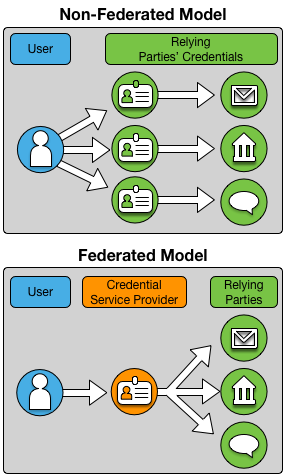{:style="display: block; margin: auto; max-width: 360px;"}
*Figure 1: Federated v. Non-Federated Identity*

Online service providers are not the only ones that face additional challenges from this model. Most consumers are all too familiar with the ubiquitous sign-in screen requiring them to enter their username and password. While widely-known best practices state that usernames and passwords should not be shared between services, maintaining an ever growing list of logins creates friction for individuals and employees from virtually all walks of life. In many cases, users would rather risk having their identities compromised than go through the trouble of creating separate login credentials for each and every website with which they do business[1](#fn-telesign).  

To address these challenges, communities and organizations that share a common user base and transaction type have built the means to allow users to sign on and access multiple services through common login and authentication processes. This is known as federated identity management; that is, users are enabled to “federate” their identity through common, shared authentication processes and access multiple online organizations and services. Federated identity management is based on trust. Organizations must trust the federated identity management processes in order to allow access to users that were authenticated by another entity. The “rules” for federated identity management are known as **“trust frameworks”** and the organizations that agree to follow such rules and participate are known as **“identity federations.”**  

These identity federations serve as clearinghouses that can provide a basis for individuals to prove their identity or attributes when necessary to any online service provider without compromising their individual privacy or increasing the risk of catastrophic data breaches. In time, an inter-federation of clearinghouses can ensure that services that will be available to all individuals for their online transactions both with government and across the global commercial marketplace.

*1. A recent report from Telesign that surveyed 2,000 consumers in the U.S. and the U.K. notes that 73% of respondents used duplicate passwords. Further corroborating this result, the study also found that consumers have an average of 24 online accounts, but only 6 unique passwords to protect them. ([https://www.telesign.com/wp-content/uploads/2015/06/TeleSign-Consumer-Account-Security-Report-2015-FINAL.pdf](https://www.telesign.com/wp-content/uploads/2015/06/TeleSign-Consumer-Account-Security-Report-2015-FINAL.pdf)*{:class="small"})

### 1.1	Purpose & Scope
This document provides considerations for communities interested in pursuing federated identity management when establishing the multilateral agreements that make up a Trust Framework. It examines the various roles involved in an identity federation, what to consider from a legal standpoint, and the issues of establishing and recognizing conformance.

More broadly, this publication will serve as an educational document to spread the knowledge of identity federations and trust frameworks to a more general audience. Additionally, NIST seeks to increase standardization of the language around identity federation and trust frameworks and to set a broad, common understanding of the concepts in order to facilitate their widespread adoption.

While this document explores some elements for consideration when forming an identity federation and trust framework, it is not intended to be a how-to guide that gives specific instructions or templates for their development. NIST believes that this is best left to the experts who are familiar with the needs of their specific community. Also, this does not represent a technical guide for the protocols and interfaces needed to exchange information in a federation.

### 1.2	Audience
NIST created this publication for organizations that provide online services and who seek to minimize the cost and administrative burden of operating stand-alone identity management systems for their online users. The document is written for organizations and individuals that could benefit from assistance in forming an identity federation with other online service providers and focuses on the administrative aspects for building trust frameworks to support identity federation and online trust. Typically, identity federations are formed among organizations that have a common, or largely overlapping, user base and that provide similar, or complementary, types of online services and applications.
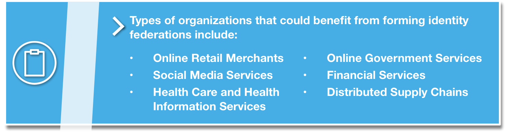{:style="display: block; margin: auto; max-width: 640px;"}

The diversity of various industries and sectors imply diverse needs and challenges, but in identity NIST continues to find a large degree of common ground and overlapping requirements in information technology. In this document we hope to demonstrate that trust frameworks can provide a foundation for trust in federated identity among many communities of interest and also present the range and scope of options available to organizations when developing trust frameworks to address the needs of their particular communities.

## 2.	Identity Federation & Trust Frameworks
In an identity ecosystem that supports secure and convenient access to online services, trust frameworks play a vital role by laying the foundation upon which the various participants can trust each other. Put simply, trust frameworks aim to move from expensive and resource intensive bilateral agreements toward streamlined, efficient, and reliable multilateral arrangements that still meet the needs of all participants.

*A **trust framework** is developed by a community whose members have similar goals and perspectives. It defines the rights and responsibilities of that community’s participants in the Identity Ecosystem; specifies the policies and standards specific to the community; and defines the community-specific processes and procedures that provide assurance. A trust framework considers the level of risk associated with the transaction types of its participants; for example, for regulated industries, it could incorporate the requirements particular to that industry. Different trust frameworks can exist within the Identity Ecosystem, and sets of participants can tailor trust frameworks to meet their particular needs. In order to be a part of the Identity Ecosystem, all trust frameworks must still meet the baseline standards established by the Identity Ecosystem Framework.[2](#fn-nstic)*

*2. **National Strategy for Trusted Identities in Cyberspace** - Enhancing Online Choice, Efficiency, Security, and Privacy, April 2011, [http://www.whitehouse.gov/sites/default/files/rss_viewer/NSTICstrategy_041511.pdf](http://www.whitehouse.gov/sites/default/files/rss_viewer/NSTICstrategy_041511.pdf)*{:class="small"}

From the perspective of an online service provider, there are many reasons to participate in an identity federation. Some of the benefits to doing so include:  

-  Increased efficiency and cost savings from not having to manage login information for its users,
-  Risk management through the use of multilateral agreements,
-  Improved system design decision criteria based on defined security expectations aligned with the community being served, and
-  Customer convenience and reduced risks associated with having to manage fewer discrete credentials.

### 2.1.	Identity Federations

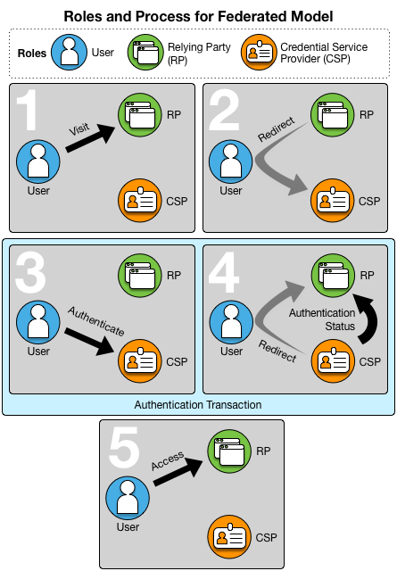{:style="display: block; margin: auto; max-width: 360px;"}
*Figure 2: Roles and Processes in a Federated Model*

**Federated Identity Management** is a means to enable users to access the systems and applications of multiple organizations using the same login credentials. It allows users to choose a **credential service provider (CSP)** (for example an email or social media provider). Users register once with their selected CSP and establish online credentials to be managed by that CSP for authentication. When a user wants to access a **relying party (RP)** service or application (for example a bank or online retailer), that user is redirected to the selected CSP for authentication using the credentials established with that CSP. The CSP then presents the status of the authentication to the RP so that the user may be granted access to the service or application they wish to use. In this way, users do not need to register or establish login credentials with each service they want to access and they only need to provide their credentials to their selected CSP rather than to each service they want to access.  

In the simplest terms, identity federations consist of CSPs and RPs that have agreed to participate in a specific federated identity management arrangement. CSPs register, establish credentials, authenticate users, and assert user authentication status to federation RPs. RPs consume identity assertions provided by the CSPs and use the authentication status information to authorize user access to online services and applications. **Trust amongst members of an identity federation is foundational to its operation and is established through the set of agreements and associated rules that are specific to that community.** Such rules for a federated identity management arrangement are known as its trust framework.

### 2.2.	Trust Frameworks
As defined above, a trust framework is the set of rules and policies that govern how the federation members will operate and interact, including:

- Conducting identity management responsibilities,
- Sharing identity information,
- Using identity information that has been shared with them,
- Protecting and securing identity information,
- Performing specific roles within the federation, and
- Managing liability and legal issues.

Trust frameworks serve as the basis for the multilateral agreements among all of a federation’s members that enable the trust and governance of a federation’s operations.

{:style="display: block; margin: auto; max-width: 640px;"}

## 3.	Roles & Responsibilities

### 3.1.	Federation Administrators

#### Role description
Federation administrators are responsible for the governance of an identity federation. They are organizations, often set-up by their constituent members, to administrate the activities associated with operating an identity federation[3](#fn-identityfederation).  The structure of this organization may vary, depending on the nature of the community, the level of risk an identity federation seeks to address, and whether or not it is driven by regulatory or other such considerations. For example, federation administrators may take the form of government programs, corporate entities, not-for-profit membership organizations, or industry associations.

In this way, federation administrators act as policy clearinghouses for digital identity services.

#### Responsibilities
Federation administrators:

- Establish the trust framework rules and requirements,
- Develop and manage the documentation,
- Manage membership and participation,
- Manage member conformance to the trust framework’s rules,
- Maintain, promote and evolve the federation, and
- Oversee the smooth operation of the federation.

*3. While federation administrators are also commonly called trust framework providers or trust framework operators, for the purposes of this document we will only refer this role as “federation administrators.”*{:class="small"}

### 3.2.	Credential Service Providers

#### Role description
Credential service providers (CSPs) issue and maintain the electronic credentials that individuals use to access online services[4](#fn-onlineservices).  For example, some email providers act as CSPs when they allow users to use their credentials to log into other vendor’s services, as do some social media sites. CSPs may specialize in managing identities for the specific community served by a trust framework, or may offer a more broad-based identity service, of which some users fit the profile targeted by the framework. In the latter scenario, a CSP may operate in multiple trust frameworks, in effect providing a single user identity service in multiple communities, such as in both healthcare and banking.

In this way, CSPs act as technical clearinghouses for digital identity services.

#### Responsibilities
CSPs:

- Register/enroll users,
- Perform identity proofing,
- Manage credentials, and
- Perform user authentication and authentication status assertion.

See [Section 5, System Rules](#sr), of this document for a more detailed explanation of these activities.

*4.Other commonly used terms for CSPs include identity providers (IdPs) and identity service providers (ISPs).*{:class="small"}

### 3.3.	Relying Parties

#### Role description
Online service providers operating within a federation are known as relying parties (RPs) and are organizations that offer services, applications, and information that require restricted access. Examples of RPs include a retail bank’s online services and online retailers. Relying parties accept (rely upon) user authentication status assertions from federation CSPs, rather than operate separate identity management systems of their own. They must be able to trust the identity information they receive from a CSP about a user’s identity in order to make decisions about whether or not to allow that user access to their online services or products. RPs may still maintain some account information, especially if it is core to its business, such as a retailer keeping browsing and purchase history for a user and perhaps shipping and payment information. In such a case, the RP may simply outsource the authentication of the user to the CSP, subject to the rules of the federation.

In this way RPs can achieve their goal of providing their online service without bearing the cost of managing identity services that are neither core to their business nor their core competency.

#### Responsibilities
RPs:

- Consume the identity information provided by the CSPs, and
- Authorize access to users, in accordance with the rules of the federation.

### 3.4.	Users

#### Role description
As consumers of the services offered by the RPs, end users (users) are not formally members of an identity federation. However, they typically bear certain responsibilities depending on the nature of the trust framework.

By having credentials that are accepted under trust frameworks, users can have a consistent experience in which their credentials are accepted and their data treated in the same manner regardless of provider.

#### Responsibilities
Users:

- Protect their identities and digital credentials from fraud and misuse,
- Use their credentials in the manner for which they are intended, and
- In some cases, undergo some manner of identity proofing, as explained later in this document.

## 4. Trust Framework Components

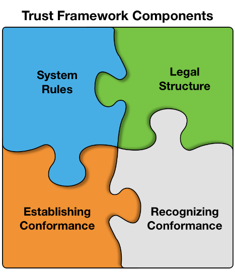{:style="display: block; margin: auto; max-width: 280px;"}
*Figure 3: Trust Framework Components*

Identity federations consist of different types of organizations; some provide identity management operations for the federation (CSPs) and other organizations that consume identity information from CSPs in order to allow users access to their online systems, applications and transactions (RPs). If there are only a few members in the identity federation, it would be manageable to establish bilateral agreements among the members to define their roles and responsibilities. However, identity federation is intended to scale to large online communities and trust frameworks are the means to scale and enable identity federation to work for these communities.

In an identity federation’s trust framework, the individual components define how federation members will interact with each other. By defining the expectations members have of each other, a federation is able to support the trusted transactions for which it was created. For the purposes of this document, we have identified four components that characterize an identity trust framework:

- **System Rules**, which govern the interactions between members,
- A **Legal Structure**, which identifies the rights, responsibilities, and liabilities associated with participation in the federation,
- A way of **Establishing Conformance** across its members, and
- A way of **Recognizing that Conformance**.

The following sections, explore these concepts further and explain how these components fit together to support an identify federation.

#### Risk Management and trust

Mutual trust among federation members is crucial for identity federation to work. Trust is typically generated through experience and reputation. For example, based on experience, we trust that we can use our debit cards in virtually any ATM and reliably and safely conduct financial transactions in any location. Our interactions have taught us that debit transactions are executed in a reliable and secure manner and when errors do occur they are handled according to established rules and processes. We generally recognize and make risk evaluations in differing environments, such as when something does not seem right with a retailer or an ATM and we choose not to hand over our card.

Identity federations aim to reach similar levels of trust and expectation among members and users. However, it will take some time to build similar experience with online federated systems. To build trust now, identity federations need to identify potential risks and manage those risks. Identity federations have accomplished this by clearly articulating the roles and responsibilities of all members and how those responsibilities will be met. Trust frameworks are the means to present those expectations, typically in the form of rules and agreements.

Because each community operates its online transactions at a unique level of risk, the elements that go into a trust framework should be selected to address the specific needs of its members. Risk management always involves balancing the costs of risk mitigation and risk tolerance. So trust framework development should be considered as a process that involves fulfilling expectations through risk analysis, risk management, risk tolerance, performance, and experience. Accordingly, identity federations will need to analyze risks to the types of online services that they offer, identify ways to manage those risks, determine the most effective and efficient solutions, and incorporate those solutions in their trust framework.  

Fortunately, there are several methodologies available for use in identifying the risk profile of their members and determining appropriate rules, legal documentation, and conformance processes for their trust framework. Whichever framework is used, however, the core set of risk management practices must reflect a federation’s participants’ understanding of their risk environment, and the specific components must be chosen to mitigate these risks – be they technical, legal, or business. The following sections present components that are typically addressed in trust frameworks.

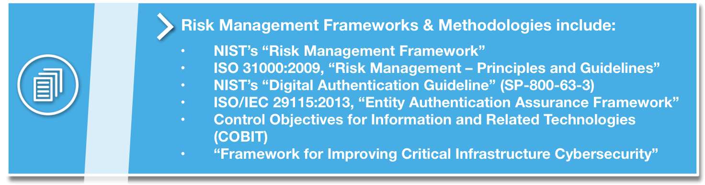{:style="display: block; margin: auto; max-width: 640px;"}

## 5. System Rules

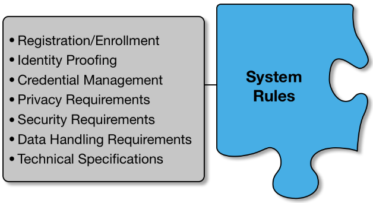{:style="display: block; margin: auto; max-width: 320px"}
<!-- Figure x: Xyz -->

A fundamental purpose for building trust frameworks is to define the identity management operations and technical requirements needed to support the identity federation and to clearly assign responsibility for performing those operations. Since federation members expect and need to trust those identity management operations, the identity management operations of the federation are typically presented as requirements or rules. The federation members responsible for performing specific operations are expected to demonstrate conformance with the rule set specific to their role.

### 5.1.	Registration/Enrollment

#### What is registration?
Registration, or enrollment, is the process of creating an identity record within an **identity management system (IDMS)** and associating it with attributes specific to a particular User. Each identity record within an IDMS should be unique, such that there is enough information about a User to distinguish them from other users managed by the system.

In many cases, ID proofing and registration are closely linked and may occur in the same session. For instance, for registration processes that require an applicant user to appear in-person in front of a registration agent, the identity documents required for ID proofing may be scanned into the system and associated with the user’s identity record.

#### Why should registration be included in a trust framework?
Members of a federation must know what processes and procedures were followed when creating an identity record, including what types of systems were used to capture the results of the ID proofing and how those results are associated with, or bound, to a user.

#### Registration options, based on risk
For lower risk transactions, registration or enrollment may be as simple as asking a new user to create a username and password. Depending on the nature of the services supported by the federation, additional information may be requested, such as mailing addresses, phone numbers, and email addresses. Other factors that may affect registration process requirements include whether an identity federation allows for pseudonymous identities.

Federations that operate to mitigate higher levels of risk often require the organizations that perform the enrollment process (often referred to as Registrars or Registration Agents) to meet certain requirements before they can be authorized to perform their role, including minimum skills or experience levels and/or the completion of training on the system. For the highest risk environments, potential Registrars may even be required to pass a background check before they can be “certified” to register users in a system.

Additionally, the amount and types of information captured and associated with a user may vary, depending on the degree of rigor applied within a federation. On the lower end of the spectrum, username and password or unverified demographic information (e.g., mailing addresses, phone numbers, email addresses) may be included in identity records. Where a moderate level of risk is being addressed, that information may need to be validated against authoritative sources. For the highest risk transactions, additional data, such as scanned documentation or biometrics, may be collected during in-person ID proofing. In any case, the only information that should be collected and maintained is the information that is needed for enrollment and subsequent identity proofing processes.

As in other aspects of an identity federation’s trust framework, decisions must be made and included in the documentation as to the amount of rigor, commensurate with a risk profile, its members must apply while performing their roles.

### 5.2.	Identity Proofing

#### What is Identity Proofing?
Identity proofing is the process by which a CSP collects and verifies information about a person for the purposes of issuing credentials to that person.  In other words, it’s how CSPs require applicants to prove they are who they claim to be.

#### Why should ID proofing be included in a trust framework?
By defining baseline requirements for ID proofing, identity federations set a foundation for their members to trust that users have been vetted to an appropriate level prior to being issued a federation credential. Depending on the level of risk associated with a federation, required ID proofing activities can be as simple as verifying an email provided by a user, or as complicated as requiring a user to appear in person in front of a trusted agent with one or more identity documents.

#### ID proofing options, based on risk
Identity federations should choose an identity proofing methodology to include in their Rules, based on the amount of risk associated with its community’s transactions.

- **Self-assertion/no identity proofing**: For transactions with the lowest associated risks, a CSP can issue an identity credential based on an unverified statement that an individual is who they claim to be. Self-assertion of an identity is appropriate when the resultant credentials consist of a simple user name and password, issued for the purposes of identifying a user across multiple sessions. Identity proofing is also not required for **anonymous** and **pseudonymous** transactions.
- **Remote identity proofing**: Remote identity proofing is appropriate for moderate-risk environments and requires a User to provide additional evidence in support of their asserted identity. Options for remote proofing include knowledge-based challenges, which involve checking information provided by an applicant against an authoritative data source, and sending one-time codes to an applicant’s email address or cell phone.
- **In-person identity proofing**: In-person proofing is the most rigorous proofing method and is appropriate for higher levels of risk. In-person proofing involves an applicant appearing in person, with supporting evidence of their identity, in front of an authorized agent for the identity service.

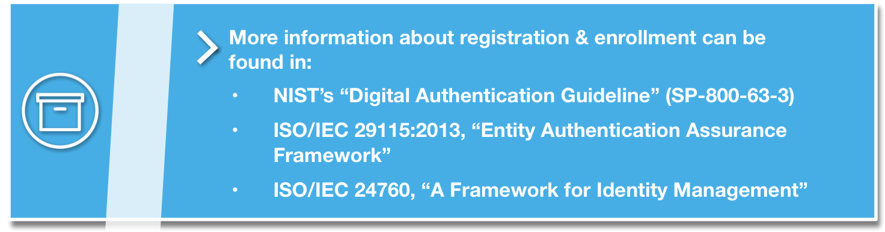{:style="display: block; margin: auto; max-width: 640px;"}

### 5.3.	Credential Management

#### What is credential management?
Credentials are issued as the result of the registration or enrollment activity and are what users actually use, or assert they are, in order to gain access to online systems and services. Credentials consist of an identifier, which points to a user’s unique record in an IDMS; an authenticator, or the mechanism by which a user is verified as being the same person who was registered; and any bound attributes, or information about the identity, which may be transmitted by the CSP to an RP. In many cases, the process of issuing a credential is transparent to the user, who simply knows they were asked to provide some information about themselves and then created, or were provided with, a user name to use when logging into the system.
Credential management, then, is the set of processes a CSP follows during the lifecycle of an identity. Depending on the requirements of a particular identity federation, lifecycle stages may include any or all of the following: credential issuance, updates, renewal, expiration and revocation.

#### Credential management options, based on risk
Trust frameworks can define minimum requirements for any stage of the credential lifecycle, depending of the level of risk mitigation that needs to be achieved. Trust framework system rules may include specific expectations for some or all of the lifecycle stages, as listed above. Higher levels of risk generally include stricter requirements that involve higher costs and effort on the part of the members; however, many identity federations believe this extra burden is warranted in order to maintain the integrity of the identities and support a high level of trust.

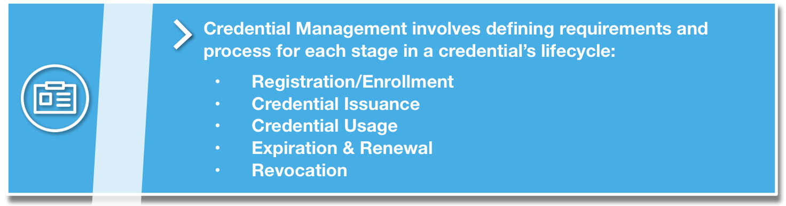{:style="display: block; margin: auto; max-width: 640px;"}

### 5.4.	Privacy Requirements
Protecting a user’s privacy goes beyond a single transaction or identity service. Through federated technologies, an IDP could have insight into a range of transactions a user is conducting online across a variety of RPs, building a narrative about a user that she never anticipated, or wanted, the IDP to have.

Thus, trust framework developers should consider including requirements that serve to protect a user’s privacy, including the use of policy and technical controls. An example of a technical control is a double-blind architecture, which prohibits a CSP from seeing which RPs a user is accessing, and prohibits an RP from seeing which CSP a user is leveraging. While a double-blind architecture could benefit a user’s privacy using federated login, it also could help companies to ensure that a CSP is not, for instance, harvesting an RP’s customer list, which is a valuable business asset.

In order to select the appropriate controls, a trust framework may also require privacy risk management practices in identifying and managing privacy risks in an information system. Some trust frameworks build these privacy-enhancing features into their overall requirements, while others address privacy in its own separate document. Either way, a trust framework’s policy around protecting privacy should be clearly articulated in its membership agreements and policy documents, using plain language that is easily accessible to users. Those trust frameworks that place user privacy as a primary concern may even consider including it explicitly in their vision statements and operating rules.

### 5.5.	Security Requirements
IT system security is an essential component of any risk reduction and management scheme and trust framework developers can use the traditional three pillars of IT security model (i.e., confidentiality, integrity, availability) to inform their security-related policies and requirements. Setting expectations of its participants to protect the confidentiality, integrity, and availability of their services sets a foundation for trusted transactions between the parties. As with the other components, the level of risk and potential harm should drive the amount of attention paid to security requirements.

### 5.6.	Data Handling Requirements
Data handling and usage requirements establish what identity data can be transmitted amongst member organizations and how that data must be used, managed, and protected. Identity federations should consider setting guidelines and requirements about how their members protect the identities themselves, as well as any attributes associated with those identities. Generally, the less identity data exchanged and stored, the better.

### 5.7.	Technical Specifications
By identifying a common set of technical protocols and standards, trust frameworks promote the seamless exchange of authentication assertions and identity information amongst its members. To achieve the greatest level of interoperability, identity federations are encouraged to adopt open standards, which are often more cost-effective and flexible that proprietary solutions.

At a minimum, a trust framework’s systems rules should define protocols and standards for handling the exchange of authentication data and for assessing the strength or validity of an asserted authentication.

## 6.	Legal Structure

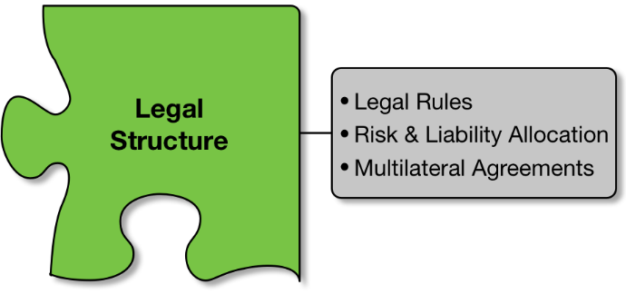{:style="display: block; margin: auto; max-width: 320px"}
<!-- Figure x: Xyz -->

Trust frameworks present the operational and technical requirements for federated Identity management, and must also provide the legal basis to bind those requirements to federation members. Identity federation members voluntarily agree to participate in the federation and follow the trust framework rules. While there are varying means to bind members to federation rules, the most straightforward and common method is through contract or agreement. Members become legally bound to the trust framework rules through signed agreements to comply with the operational and technical rules as well as the legal rules, rights, and obligations of federation members. Therefore, trust frameworks and associated member agreements form a contract-based legal structure which applies to all federation members. This legal obligation is critical for providing the assurance and trust for the federated identity system.

### 6.1.	Trust Framework Legal Rules
Trust frameworks are created within the framework of public laws that apply within the jurisdiction of federation operations. Public law established through statutes, regulations, and common law will apply to federated management operations and systems that operate within their jurisdiction; applicable general laws include contract law, tort law, business law, etc. Some public laws regulate activities that will directly apply to identity management systems. For example, public law regulating information privacy and data protection of personal information will apply to identity management systems and operations (e.g., Federal Trade Commission Act, Fair Credit Reporting Act, and the European Union Data Protection Directive). Public law and rules may also apply to specific types of federation communities and transactions; examples include:

- The Child Online Privacy Protection Act (COPPA) regulates privacy protections for online service providers directed to children under 13 years of age;
- The Financial Services Modernization Act (Gramm-Leach-Bliley Act) regulates the collection, use and disclosure of financial information for financial institutions such as banks, securities firms and insurance companies, and to other businesses that provide financial services and products;
- The Health Insurance Portability and Accountability Act regulates medical information and applies broadly to health care providers, data processors, pharmacies and other entities that come into contact with medical information.

Trust framework administrators need to be aware of and understand the impacts of applicable public laws on federation members and operations when creating trust framework rules and on an ongoing basis. Obviously, trust framework rules must be in compliance with applicable existing and emerging public law. This is particularly important given the scope of online commerce and services and the potential for international, cross-jurisdictional business and identity federation.

Legal rules serve to bind federation members to all trust framework rules and requirements, and present responsibilities and obligations of all members to each other and clarify any administrative or legal aspects involved in their participation in the federation. These may include any warranties for goods and services, compliance requirements beyond the operational and technical and operational requirements, and enforcement mechanisms for non-compliance. Trust framework legal rules also typically provide means and processes for dispute resolution in order to try to resolve disputes between federation members through administrative processes, rather than court action.

### 6.2.	Risk and Liability Allocation
A consideration for trust framework legal rules is the allocation of risk and liability of federation members. Authentication transactions involve data exchange among a user, an RP, and a CSP. There are potential risks to the successful execution of these transactions and subsequent access authorizations that may present risks to any of the parties involved. For example, the CSP may have erred in the enrollment information or credentialing of the user, users may be denied service due to a disruption in system services, relying parties may have allowed unauthorized access to protected resources due to identity theft or fraud. The result of any of these circumstances is that a federation member or user may feel that they have suffered a loss (e.g., financial, exposure of personal information, exposure of relying party protected resources). Any of the federation operations may present risks that something may go wrong which introduces risks or, possibly, actual losses to any of the federation members.

The general rule is that the party affected by the loss will bear the loss, unless the liability for the loss is allocated to another party[5](#fn-liability).  However, liability losses are a zero-sum equation; that is, allocating liability does not defer the loss, it simply allocates responsibility to a particular party. Trust framework administrators may create legal rules to allocate risk and liability for various reasons; typically risk and liability allocation has been used to ensure equitable allocation of risk and liability among federation members.

Furthermore, the objective of the allocation of risk and liability may be to ensure the participation or protection of a class or category of system participants critical to the federation. An Industry example of such risk and liability allocation is the limitation on personal account liability for losses occurring through electronic funds transfer in which liability may be allocated to the card issuing financial institution under certain circumstances (i.e., Electronic Funds Transfer Act, Federal Reserve Regulation E). Prior to this arrangement, uncertainty existed across multiple parties and the least cost avoider lacked incentive to mitigate risk, in some ways stifling the market.

*5. **The Vocabulary of Identity System Liability**, The Open Identity Exchange/Edwards Wildman Palmer LLP, by Thomas J. Smedinghoff, Mark Deem, and Sam Eckland.*{:class="small"}

### 6.3.	Multilateral Agreements

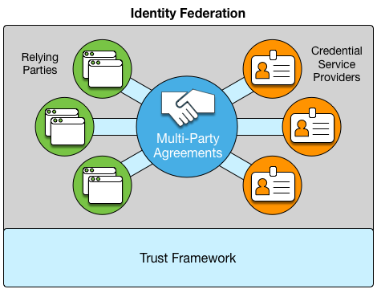{:style="display: block; margin: auto; max-width: 320px"}
<!-- Figure x: Xyz -->

The principal purpose of trust framework legal rules is to bind the applicable operational, technical and legal rules and requirements to all federation members. Federation trust and reliance on identity management operations will not be achieved without clear commitment of all members to comply with trust framework rules. This commitment is achieved through executing legally binding agreements among all federation members. Separate bilateral agreements could be executed between the parties in federations with few members, but this would be cumbersome and costly and may jeopardize federation trust since there is no assurance of binding all members to the same rules and requirements if separate agreements among parties are executed; this would defeat the purpose of the identity federation.

Common multilateral agreements typically bind federation members to the applicable operational, technical and legal rules of the federation. Multilateral agreements present the same terms, rules and requirements for all federation members. The specific requirements and responsibilities for credential service providers and relying parties are applicable to those specific roles, but are clearly presented for all members. Multilateral agreements streamline the process, allow the federation to scale, and enable each participant to easily see and understand the roles, responsibilities, and obligations of the other federation members. Multilateral agreements will also provide assurance that all members are bound to the same common enforcement mechanism of a legally binding agreement with common terms. The multi-party agreement should incorporate all relevant rules and requirements either directly or by reference if presented in a separate document(s).

## 7.	Establishing Conformance

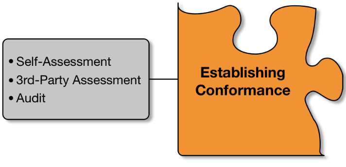{:style="display: block; margin: auto; max-width: 320px"}
<!-- Figure x: Xyz -->

Establishing and enforcing conformance amongst its members to its set of agreements and operating rules is vital to an identity federation’s functioning. Conformance is the degree to which a federation member has implemented, and is adhering to, the rules of the federation. The amount of rigor, and therefore burden, an identity federation requires of its participants in demonstrating conformance to its trust framework should be commensurate with the degree of risk it is designed to address. Frameworks that accommodate different kinds of transactions, with differing amounts of risk, may choose to offer multiple levels of conformance based on a graduated set of rules and requirements. This section provides options a Federation Administrator may consider when defining how they will establish conformance amongst its members.

### 7.1.	Self-Assessment

#### What is a self-assessment?
A self-assessment is the process by which a member organization (CSP or RP) evaluates its processes and systems against the stated requirements of a trust framework and is the simplest way for a member to demonstrate conformance within an identity federation. Used primarily in low-risk environments, self-assessments can often be completed using in-house resources and, therefore, impose a lower administrative burden on the member organization.

Trust frameworks often have a process by which its members can conduct their self-assessments and may set requirements for the degree to which all its requirements must be met in order operate within the parameters of the federation.

Upon completion of the assessment against requirements and standards, the trust framework may require member organizations to attest to their assessed conformance to the requirements of the trust framework.

#### When should they be used?

Self-assessment is an effective and efficient means to provide assurance that federation members conform to the rules and requirements of the trust framework. Self-assessment should be considered when federation members expect or require greater assurance than a signed agreement in order to build trust amongst all its members. Self-assessment processes require assignment of staff resources, but since the resources are internal to the organization, the assessment processes can be planned and executed efficiently to minimize overall impact. Efficiency and higher assurance are key considerations for establishing self-assessment conformance requirements.

### 7.2.	3rd-Party Assessment

#### What is a 3rd-party assessment?
For federations that require higher levels of trust amongst their members, 3rd-party assessments provide the means for members to demonstrate their adherence to the federation’s operating rules. As the name indicates, 3rd-party assessment arrangements involve independent entities trained and certified to perform assessments of requirements for a specific community or trust framework. Federation members employ certified assessors to evaluate their systems and services against the framework’s requirements and assessment criteria. It is typical for 3rd-party assessors to provide a notice, or attestation of conformance, to the trust framework’s rules on behalf of the service provider.

#### When should they be used?
Independent, 3rd-party assessments are required when a higher level of assurance is needed to demonstrate conformance among federation members, or when there is little tolerance for operational risk. As with most risk mitigation strategies, higher assurance and lower risk will result in higher burdens. The planning, contracting and execution of 3rd-party assessments will result in higher costs than self-assessments, so the need and member expectations for greater assurance must be justified. Third-party assessments must meet established federation standards and the results can be relied upon with a higher level of assurance.

### 7.3.	Audit

#### What are audits?
Audits are a standardized method for evaluating conformance to federation or industry requirements. Auditors are typically certified to meet established requirements of audit organizations. Independent audits may be required to ensure an identity federation member is conforming, often both technically and procedurally, to a trust framework when high assurance and low risk tolerance are needed and the federation does not provide for the certification of 3rd-party assessors. A framework that requires audits as a means of acknowledging and enforcing conformance often defines the specific roles and responsibilities associated with the auditors and the auditees and identifies consequences should the responsibilities not be met.

In addition to defining how audits must be conducted, identity federations may include in their framework documentation when and how often members should be audited in order to ensure their continued conformance to the framework’s rules and requirements.

As noted for 3rd-party assessments, it is typical for auditors to provide a notice or attestation of conformance to the trust framework rules on behalf of the audited service provider.

#### When should they be used?
Identity federations that require their members to undergo audits usually do so because the federation operates within an industry that is subject to regulatory or statutory oversight. The burden on its members is high, but so is the potential harm associated with either not complying with the requirements, or with a compromise of users’ privacy or security. In fact, in many cases, industries that are subject to these conditions will often form an identity federation to provide a standardized method for its members to meet the requirements.

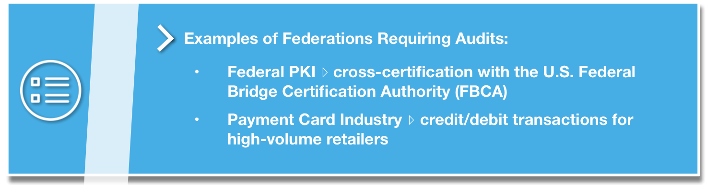{:style="display: block; margin: auto; max-width: 640px;"}

## 8.	Recognizing & Communicating Conformance

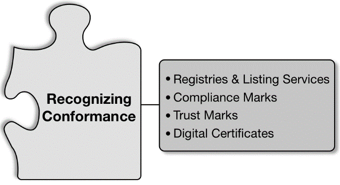{:style="display: block; margin: auto; max-width: 320px"}
<!-- Figure x: Xyz -->

Conformance recognition is the process by which identity federations enable their participants to communicate alignment with the technical rules and legal stipulations of the framework. It is done only after completion of the selected conformance testing process.

It is not enough for federation participants to simply establish their conformance; they must also be able to communicate that conformance to other federation members. In addition to establishing cross-boundary trust, enabling discovery of approved services and entities, and - in some cases - promoting a competitive service market, trust frameworks must also be able to support mechanisms for the communication and recognition of conformance. There are many ways this can be achieved, ranging in complexity from a simple registry or listing service, to trustmarks and digital certificates.  There are even emerging approaches that seek to express federation conformance through dynamic and machine readable mechanisms to allow for real time federation and inter-federation

Not all mechanisms are appropriate or necessary for every community, and they are not mutually exclusive. As with most aspects of trust framework development, the selection of an appropriate conformance recognition program and mechanism requires close coordination with community members and a sound understanding of constituent needs. When considering which mechanism is the most appropriate for an emerging trust framework it is important to take into account the following considerations:

- The scalability and cost of implementing a recognition mechanism,
- The size of federation membership and amount of churn amongst members,
- The technical maturity of framework participants and the federation operator,
- The sensitivity and security requirements associated with the operating environment,
- Alignment with rigor of conformance evaluation, and
- Governance and management capabilities of the community.

### 8.1.	Registries & Listing Services

#### What are registries and listing services?
The most basic and straightforward of recognition mechanisms, Registries and Listing Services offer a scalable and easily implemented solution for communities and federation administrators to communicate and discover services which have been deemed compliant with rules and requirements. These may be as straightforward as a hosted website with approved services and information about their conformance. The sophistication of the implementation, level of detail provided on the listed service providers, and search and discovery capabilities are all easily tailored based on the needs of the identity federation. Likewise, the cost and resources required to build and stand-up such a service are relatively limited and directly tied to the sophistication required to meet community needs.

Along with the limited cost of implementation and high scalability, there are some additional considerations for the use of registries to present compliant services. Discovery requires framework participants, especially RPs, to play an active role in seeking out and identifying compliant services. This could limit the growth of federated services due to the effort required for each new service an RP must discover and actively integrate with. Registries may offer listed organizations only limited opportunity to market and advertise framework compliance since the format and content is often standardized. Aside from pointing to the registration service through (ideally) approved messaging, there are limitations for services to directly convey compliance from their own properties. As with the discovery issues addressed above, this also requires RPs or potential users to actively seek out the registry and confirm the services listed status.

#### When should they be used?
Registries for compliant organizations can be used for any type of federation, but are most typically used where self-declaration or self-assessment is used to determine compliance with federation rules. In this way, compliant services can be publicly listed for all federation members and for the public in a simple, straightforward manner. There should be alignment between the rigor of the compliance evaluation process and the type of conformance recognition mechanism or program that is put in place. Registries, when used independently, are most appropriate for programs that implement low cost and self-assessed processes. Similarly, registries offer a scalable, low cost means to convey compliant organizations with low overhead and maintenance for the federation administrator.

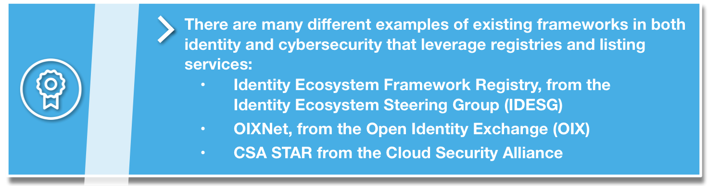{:style="display: block; margin: auto; max-width: 640px;"}

### 8.2.	Compliance Marks

#### What are compliance marks?
Often used to augment a registry listing to make marketing and discovery of compliant services more effective, a compliance mark is a visually recognizable mark that can be placed on the web properties and communication materials of complaint framework participants. These can—and in most cases should—be further supported by electronic verification capabilities.

#### When should they be used?
Implementing compliance marks carries very little technical burden for framework participants because, even when augmented by electronic verification, it requires little more than adding an image and URL to a website, yet they do carry an overhead burden for the federation administrators. Compliance marks are trademarked and legally protected images that require appropriate documentation to be put in place by the federation administrator to ensure that they are registered with responsible national or international authorities (e.g., U.S. Patent and Trademark Office) and that the terms for their use are properly documented and agreed to by all participants.
Establishing terms of use and ensuring proper compliance mark registration are short term, typically one-time tasks. However, to protect the integrity of the mark and the reputation of the framework, the federation administrator or other delegated authority will need to maintain the capability to monitor the mark’s use, detect fraudulent or inappropriate applications, and initiate action to remediate any infractions. While internal framework misuse, for example a framework participant posting a modified or incorrect mark, can often be handled through the core legal and enforcement mechanisms described in Section 5 of this document, addressing external misuse presents far greater challenges. In addition to establishing processes to detect misuse (e.g., reporting capabilities, web-crawling applications), the federation administrator would also need to have the capability to take appropriate legal action against parties fraudulently using a mark (i.e., legal counsel).
Electronically verifiable marks, for example those that have an imbedded URL linked to a registry or listing, make the management and protection of compliance marks easier and enable users to more effectively detect fraudulent representations. This can enhance trust and improve discovery in a framework by enabling a community’s participants to more easily identify approved service providers.[6](#fn-marks)

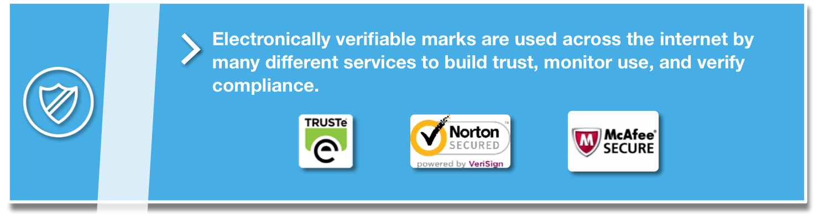{:style="display: block; margin: auto; max-width: 640px;"}

Generally speaking, the discovery and marketing value compliance marks bring to the table makes them very valuable to frameworks and their participants—as long as the Trust Framework Administrator is sufficiently able to institute and protect its compliance mark.

*6. The graphic provides several common examples of the many electronic verifiable marks & logos in use today. It is not exhaustive in nature.*{:class="small"}

### 8.3.	Trustmarks

#### What are trustmarks?
Like compliance marks, trustmarks are a visual indication that a service provider is compliant with a federation’s requirements.

Trustmarks comprise a very specific subset of compliance marks. In addition to being electronically verifiable, these logos or seals are backed by rigorous third party validation, assessment, or auditing. Certification of conformance and associated trustmarks may be issued by the assessor, the federation, or a separate certifying body on behalf of the federation. The key point is that certification trustmarks result from independent 3rd-party assessments and both the assessing and the certifying organizations stand behind the certifications with their own brand name and reputation. Therefore, trustmarks serve as a reliable and high assurance means to convey compliance with federation rules.

#### When should they be used?
The integrity of a trustmark is absolutely essential, both to promote widespread confidence among framework participants and their customer base and to ensure the security of transactions. For this reason, the trustmark must inherently be electronically verifiable and the method by which electronic verification is conducted must be sufficient to prevent spoofing or modification of the trustmark or the mechanisms by which it is verified.

For communities that support high risk transactions, which require rigorously verified identity solutions, and support a strong certification program, trustmarks enable a broad but secure recognition of compliant services. However, the degree of rigor and technical requirements for properly instituting these marks makes them unnecessary for emerging or lower assurance frameworks.

{:style="display: block; margin: auto; max-width: 640px;"}

### 8.4.	Digital Certificates

#### What are digital certificates?
Digital certificates are a specific type of electronic credentials that are issued and managed by a centralized authority. Identify federations that employ an infrastructure that supports certificates, called Public Key Infrastructures (PKIs), do so to meet their members’ needs for a high-degree of trust within the federation. In these situations, the Federation Operator serves not just to govern and develop the framework, but also as the technical root of trust—also known as a Certificate Authority (CA)—for all participants, issuing cryptographically signed certificates to members of the community. These are, in turn, used to sign credentials issued to individuals and organizations participating in the framework.

#### When should they be used?
Because of their high overhead (cost and procedural rigor), PKIs are generally only used in environments that require a high-degree of assurance in the identities being exchanged within closed communities, such as industry supply chains, organizations doing business with a government entity, or research communities.

## 9.	Conclusion & Other Considerations

This document provides a foundation for understanding identity federations and the trust frameworks that underpin them. It is not intended to be a comprehensive how-to guide for creating such a Federation, and only touches on many of the factors that contribute to one’s success. For organizations and communities to transition from planning and designing to building an operational Federation, communities should consider additional elements, such as:

- **Governance**. Governance addresses how an Identity Federation, at its Trust Framework, is managed and maintained across its life cycle. It defines how are decisions made, and by whom.
- **Enforcement**. If may be necessary to enforce a federation’s rules and agreements, and identity federations should define how this will be handled, and who will be responsible for managing violations and adjudicating complaints.
- **Technical Protocols & Support**. An Identify Federation should decide what role it should play in enabling the technical exchanges between its participants. This is done through identifying standards, protocols, and technologies to support interoperability among its members.

Ultimately, identity federations enable communities and organizations to manage user identities and identity data more efficiently by enabling interoperability between participants. Trust frameworks provide the glue that binds these participants together—defining the rules for how they interact, laying out roles and expectations, providing clear liability and legal processes, and enabling determinations of conformance with Federation requirements. From supply chain risk management to retail environments, the benefits of identity federations are substantial:

- The ability to consistently manage and understand risk across multiple organizations,
- The ability to limit organizational costs associated with managing individual identities,
- Streamlined user experience due to fewer credentials,
- The ability to scale and expand customer bases,
- The ability to provide more online services, and
- Increased ease of access to shared resources.

Furthermore, establishing identity federations can have impacts that extend well beyond the boundaries of a single community or organization. By creating unified structures for managing and understanding trust, the entire identity and security market will be better able to understand the state of practices and processes, identify cross sector commonalities, and eventually break down barriers (real or perceived) between sectors and markets. Eventually the expansion of federations could support the overall health and security of the ecosystem, promoting more efficient practices, and enabling consumers and citizens to more effectively access the services they both want and need. While certainly not a silver bullet, trust frameworks and the federations they support represent a shift towards a more consistent and extensible model for trust than more traditional identity management with efficiencies that extend to all parties including users.

For more information on identity federations and trust frameworks, please take a look at the [“References Section”](#appendixb) which includes references to several documents that go into greater detail on deploying identity federations.

## Appendix A.	Glossary[7](#fn-glossary)

**Authentication** - The process of establishing confidence in the identity of users or information systems. *(NIST SP 800-63-3)*

**Certificate Authority (CA)** - A trusted entity that issues and revokes public key certificates. *(NIST SP 800-63-3)*

**Credential** - An object or data structure that authoritatively binds an identity (and optionally, additional attributes) to an authenticator possessed and controlled by a subscriber. *(NIST SP 800-63-3)*

**Credential Service Provider (CSP)** - A trusted entity that issues or registers subscriber authenticators and issues electronic credentials to subscribers. *(NIST SP 800-63-3)*

**Federated Identity Management** - A means to enable users to access the systems and applications of multiple organizations using the same login credentials; a process that allows for the conveyance of identity and authentication information across a set of networked systems. *(NIST SP 800-63-3, referred to as Identity Federation)*

**Federation Administrators** - Those responsible for the governance of an identity federation.

**Federation Credential Service Provider** - See Credential Service Provider.

**Identity** - A set of attributes that uniquely describe a person within a given context. *(NIST SP 800-63-3)*

**Identity Ecosystem** -An online environment where individuals can choose from a variety of credentials to use in lieu of passwords for interactions conducted across the internet. *(NSTIC)*

**Identity Federation (n.)** - The organizations that agree to follow the rules of a trust framework in order to participate in an identity federation.

**Identity Management System (IDMS)** - Identity management system comprised of one or more systems or applications that manages the identity verification, validation, and issuance process. *(NIST FIPS 201-2)*

**Identity Proofing** - The process by which a CSP and a Registration Authority (RA) collect and verify information about a person for the purpose of issuing credentials to that person. *(NIST SP 800-63-3)*

**Identity Provider (IdP)** - See Credential Service Provider.

**Identity Service Provider (ISP)** - See Credential Service Provider.

**Multi-Factor Authentication** - A characteristic of an authentication system or an authenticator that requires more than one authentication
factor. *(NIST SP 800-63-3)*

**Public Key Infrastructure (PKI)** - A set of policies, processes, server platforms, software and workstations used for the purpose of administering certificates and public-private key pairs, including the ability to issue, maintain, and revoke public key certificates. *(NIST SP 800-63-3)*

**Registrar** - Also known as a Registration Agent, a person who performs the enrollment process.

**Registration** - The process through which an applicant applies to become a subscriber of a CSP and an RA validates the identity of the applicant on behalf of the CSP. *(NIST SP 800-63-3)*

**Registration Authority** - A trusted entity that establishes and vouches for the identity or attributes of a subscriber to a CSP. The RA may be an integral part of a CSP, or it may be independent of a CSP, but it has a relationship to the CSP(s). *(NIST SP 800-63-3)*

**Relying Party (RP)** - An entity that relies upon the subscriber’s authenticator(s) and credentials or a verifier’s assertion of a claimant’s identity, typically to process a transaction or grant access to information or a system. *(NIST SP 800-63-3)*

**Trust Framework** - The “rules” underpinning federated identity management, typically consisting of: system, legal, conformance, and recognition.

**Trust Framework Operators** - See Federation Administrators.

**Trust Framework Providers** - See Federation Administrators.

**User** - A consumer of the services offered by an RP.

*7. In this glossary, definitions not marked with a source were taken from the text of the document.*{:class="small"}

## Appendix B.	Reference Documents

#### NIST Publications & Programs
***FIPS 200: Minimum Security Requirements for Federal Information and Information Systems***, March 2013, [http://csrc.nist.gov/publications/fips/fips200/FIPS-200-final-march.pdf](http://csrc.nist.gov/publications/fips/fips200/FIPS-200-final-march.pdf).

***FIPS 201-2: Personal Identity Verification (PIV) for Federal Employees and Contractors***, August 2013, [http://dx.doi.org/10.6028/NIST.FIPS.201-2](http://dx.doi.org/10.6028/NIST.FIPS.201-2).

***SP 800-63-3 [DRAFT]: Digital Authentication Guideline***, [https://www.nist.gov/itl/nstic/special-publication-800-63-3](https://www.nist.gov/itl/nstic/special-publication-800-63-3).

***The National Strategy for Trusted Identities in Cyberspace (NSTIC)***, [https://www.nist.gov/itl/nstic](https://www.nist.gov/itl/nstic).

***NIST Cybersecurity Framework***, [https://www.nist.gov/cyberframework](https://www.nist.gov/cyberframework).

***NIST Risk Management Framework (RMF)***, [http://csrc.nist.gov/groups/SMA/fisma/framework.html](http://csrc.nist.gov/groups/SMA/fisma/framework.html).

#### Identity and Risk Related Standards
***ISO/IEC 29115:2013: Entity authentication assurance framework.*** Provides a framework for managing entity authentication assurance in a given context. [http://www.iso.org/](http://www.iso.org/).

***ISO/IEC 24760 Parts 1 – 3: A Framework for Identity Management.*** Explores core concepts of identity and identity management and their relationships and is applicable to any information system that processes identity information. [http://www.iso.org/](http://www.iso.org/).

***ISO 31000:2009: Risk management principles and guidelines.*** Provides principles, framework and a process for managing risk. [http://www.iso.org/](http://www.iso.org/).

***ISO/IEC WD 29003: Identity Proofing and Verification.*** Currently under development. [http://www.iso.org/](http://www.iso.org/).

#### Trust Frameworks
***The CertiPath Public Key Infrastructure (PKI) Bridge*** enables cross organizational trust for its member PKIs, including PIV-I providers.  [http://www.certipath.com/FederatedTrust.html](http://www.certipath.com/FederatedTrust.html).

***The Federal Bridge Certification Authority (FBCA)*** allows US federal agencies to operate their own PKIs and to interoperate with the PKIs of other agencies. [https://www.idmanagement.gov/](https://www.idmanagement.gov/).

***FICAM Trust Framework Solutions (TFS) Program*** is the federated identity framework for the U.S. Federal Government. [https://www.idmanagement.gov/](https://www.idmanagement.gov/).

***IdenTrust*** provides trusted identity solutions for its corporate clients, across a wide range of business sectors. [https://www.identrust.com/](https://www.identrust.com/).

***Incommon*** is operated by Internet2, and provides a trust framework for use for by research and higher education organizations, and their partners, in the United States. [https://www.incommon.org/](https://www.incommon.org/).

***The Kantara Initiative*** fosters identity community harmonization and interoperability across a range of public and private organizations. [https://kantarainitiative.org/](https://kantarainitiative.org/).

***Minors Trust Framework (MTF)*** is focused on children’s identity and parental consent within the context of complying with the Children’s Online Privacy Protection Act (COPPA) and emerging international policies. [http://www.generationaltrustalliance.org/minors-trust-framework/](http://www.generationaltrustalliance.org/minors-trust-framework/).

***The National Identity Exchange Federation (NIEF)*** is a collection of agencies in the U.S. that have come together to share sensitive law enforcement information. [https://nief.org/](https://nief.org/).

***The Open Identity Exchange (OIX)*** is a non-profit trade organization which promotes trusted online transactions across competing business sectors. [http://openidentityexchange.org/](http://openidentityexchange.org/).

***SAFE Bio-Pharma*** was created by the biopharmaceutical industry and its regulators to support identity trust for cyber-transactions in biopharmaceuticals and healthcare. [http://www.safe-biopharma.org/](http://www.safe-biopharma.org/).

***Transglobal Secure Collaboration Program (TSCP)*** is a government and industry partnership that has created a framework for the secure electronic transmission and sharing of sensitive information internationally. [https://www.tscp.org/about-tscp/](https://www.tscp.org/about-tscp/).
